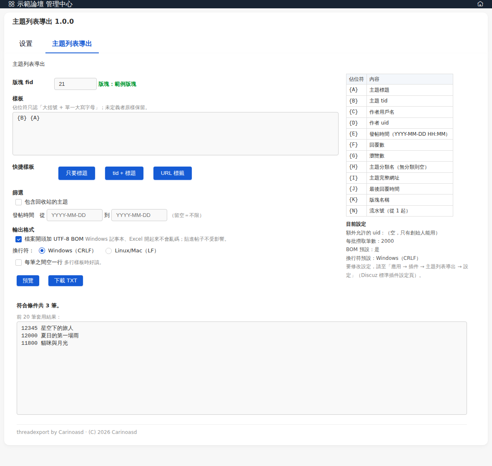
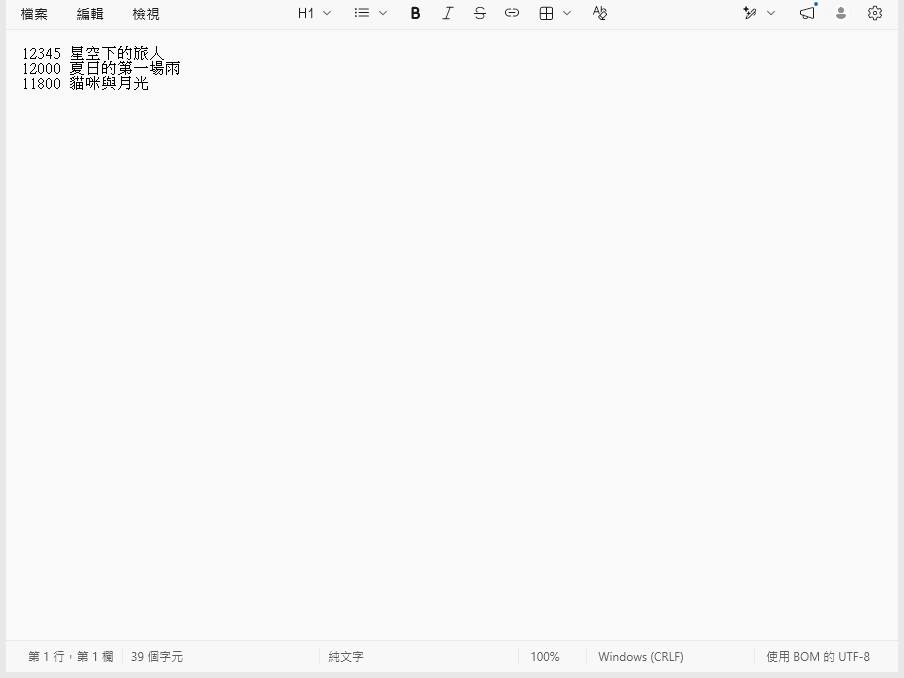

# threadexport — Discuz! 版塊主題列表 TXT 導出插件

> 繁體中文 | [English](README.en.md)

一個**只讀**的 Discuz! X5.0 後台小工具。你在後台填一個版塊 `fid`、貼一段「樣板」，插件就把該版塊
**每一個主題**（依發帖時間新到舊）套進樣板，一個主題一份，串成一個 UTF-8 純文字檔讓你下載。

把它想成「**合併列印**」：樣板是信紙、主題清單是收件人名單。想把整個版塊的標題／連結／作者整理成一份
清單（貼到公告、做目錄、匯進表格）時，不用一頁頁複製貼上，填一次條件就導出。

- 平台：Discuz! X5.0（X5.0.x）
- 授權：GPL-2.0
- 作者：Carinoasd



上圖：後台的導出頁（填 fid → 貼樣板 → 預覽 → 下載）。下圖：導出的 `.txt` 在 Windows 記事本開啟，
中文正常、換行正常、含 UTF-8 BOM。



---

## 這插件能做什麼

- 一個後台頁面：輸入版塊 `fid` → 貼樣板 → 選條件 → 預覽 → 下載 `.txt`。
- 樣板用 `{大寫字母}` 佔位符，支援多行、可夾任意文字與 BBCode。
- 篩選：單一版塊、只導正常顯示的主題、可選「含回收站」、可選發帖時間範圍。
- 排序：發帖時間新 → 舊。
- 輸出：UTF-8 純文字，BOM 與換行符（CRLF/LF）可選。
- 大版塊分批串流，任一時刻只持有一批資料（記憶體峰值極低）。
- **只讀**：整個插件只有 `SELECT`，不建資料表、不改任何論壇資料、不加前台 hook。

---

## 安裝

1. 把 `threadexport/` 整個資料夾上傳到站台的 `source/plugin/` 下（成為 `source/plugin/threadexport/`）。
2. 後台「應用 → 插件」找到「主題列表導出」→ 安裝 → 啟用。
   - 安裝只會在 `pre_common_plugin`／`pre_common_pluginvar` 建立列，**不建任何資料表**。
3. 入口：後台「應用 → 插件 → 主題列表導出 →（分頁）主題列表導出」。

> 插件的匯入 JSON 只含 Discuz 標準鍵、**不含 `author` 等非標準鍵**，可在乾淨安裝與舊版升級站上正常匯入。

---

## 權限

進入點在後台（`admin.php`），前提已是管理員。插件再加一層檢查，**兩者滿足其一才能用**：

1. 你是**創始人**（`config_global.php` 的 `$_config['admincp']['founder']`）；或
2. 你的 uid 在插件設定「**額外允許的 uid（`allow_uids`）**」清單中（逗號分隔）。

預設清單為空 → 只有創始人能用。不符合者看到 Discuz 標準無權限訊息，**不渲染頁面、不執行任何查詢**。

其他設定：`batch_size` 每批撈取筆數（500–5000，預設 2000）、`default_bom`、`default_crlf`。

---

## 樣板語法

樣板裡用 **`{大寫字母}`** 當佔位符，其餘文字（含 BBCode、`[`、`]`）原樣輸出。

| 佔位符 | 內容 | | 佔位符 | 內容 |
|---|---|---|---|---|
| `{A}` | 主題標題 | | `{G}` | 瀏覽數 |
| `{B}` | 主題 tid | | `{H}` | 主題分類名（無分類則空） |
| `{C}` | 作者用戶名 | | `{I}` | 主題完整網址 |
| `{D}` | 作者 uid | | `{J}` | 最後回覆時間 |
| `{E}` | 發帖時間（`YYYY-MM-DD HH:MM`） | | `{K}` | 版塊名稱 |
| `{F}` | 回覆數 | | `{N}` | 流水號（從 1 起，照輸出順序） |

規則：

- 只認「大括號 + 單一大寫字母」；`{Z}`、`{a}`、`{標題}` 等未定義者**原樣保留**。
- 大小寫敏感（`{a}` 不是佔位符）。同一佔位符可重複。
- 多行樣板：樣板有幾行、每個主題就輸出幾行。勾「每筆之間空一行」時每筆後多空一行。
- 標題／作者的 HTML 實體會**還原**（`&amp;`→`&`、`&lt;`→`<`、`&gt;`→`>`、`&quot;`→`"`），
  讓 `A & B` 出來是 `&`（單引號 `'` 本來就不會被轉義）。
- 時間固定 `YYYY-MM-DD HH:MM`（站台時區），不做自訂格式。樣板長度上限 2000 字元。

### 三個完整範例

假設版塊裡（新到舊）有：`星空下的旅人`（tid 12345，作者 林小雨）、`夏日的第一場雨`（tid 12000，作者 陳默）。

**範例一：一行一個標題**

樣板 `{A}`：
```
星空下的旅人
夏日的第一場雨
```

**範例二：`tid 空格 標題`**

樣板 `{B} {A}`：
```
12345 星空下的旅人
12000 夏日的第一場雨
```

**範例三：BBCode 連結（`[B]…[/B]` 這類標籤不會被誤傷，因為裡面的字母沒有大括號）**

樣板 `[URL=tid={B}]{A}[/URL]`：
```
[URL=tid=12345]星空下的旅人[/URL]
[URL=tid=12000]夏日的第一場雨[/URL]
```

多行樣板 `{A}` / `{B}` / `{C}` + 勾「每筆之間空一行」：
```
星空下的旅人
12345
林小雨

夏日的第一場雨
12000
陳默
```

`{I}` 會輸出主題完整網址，例如 `https://example.com/forum.php?mod=viewthread&tid=12345`。

---

## 輸出格式選項

- **UTF-8 BOM**（預設加）：Windows 記事本、Excel 開起來不會亂碼；貼進帖子不受影響。
- **換行符**：Windows（CRLF，預設）或 Linux/Mac（LF）。
- **每筆之間空一行**（預設不勾）：多行樣板時好讀。
- 檔名 `threadexport_fid{fid}_{YYYYMMDD-HHMM}.txt`（全 ASCII）。
- 零筆時仍會下載檔案（只有 BOM 或空檔），預覽會先顯示「共 0 筆」。

---

## 會導出哪些主題

只這一個 `fid`（不含子版塊）、正常顯示（勾回收站時額外含回收站）、非移動後的轉向帖、發帖時間在範圍內；
排序發帖時間新到舊。**置頂／待審核／草稿／被忽略／轉向帖一律不導。**

---

## 已知限制

1. **不支援 GBK 站點**：本插件直接以站台原生編碼輸出並假設為 UTF-8；GBK 編碼的站台會亂碼（未做轉碼）。
2. 不導子版塊、置頂、待審核、草稿、被忽略的帖；要導置頂得先取消置頂。
3. **無跳脫語法**：無法在樣板裡輸出字面上的 `{A}`。
4. 時間格式固定 `YYYY-MM-DD HH:MM`，不能自訂。
5. **IIS 緩衝**：若站台用 IIS，IIS/FastCGI 可能整份緩衝後才送、或在超大版塊（數十萬筆）觸發逾時；
   此時請用「發帖時間範圍」分段導出。插件記憶體只持有一批，只是使用者可能需等待。
6. **匿名發帖會露真名**：主題 `author` 欄位存的是真實用戶名（Discuz 只在顯示層做匿名），
   導出檔會顯示真名；對外分享檔案前請自行留意。
7. 標題若含 BBCode 或 `[` `]`，導出後原樣保留，貼回帖子時可能被解析。

---

## 三條退路（如何移除）

本插件只讀、不建資料表、不改任何論壇資料，移除很乾淨：

1. **停用**：後台「應用 → 插件 → 主題列表導出 → 停用」。
2. **刪目錄**：刪掉 `source/plugin/threadexport/` 整個資料夾。
3. **刪 DB 一列**：本插件無自有資料表，只在 `pre_common_plugin`／`pre_common_pluginvar` 有列：
   ```sql
   DELETE v FROM pre_common_pluginvar v
     JOIN pre_common_plugin p ON p.pluginid = v.pluginid
    WHERE p.identifier = 'threadexport';
   DELETE FROM pre_common_plugin WHERE identifier = 'threadexport';
   ```
   之後到後台「工具 → 更新快取」重建快取即可。

---

## 下載

- 原始碼：<https://github.com/Carinoasd/discuz-threadexport>
- 安裝包：[Releases](https://github.com/Carinoasd/discuz-threadexport/releases) →
  [v1.0.0](https://github.com/Carinoasd/discuz-threadexport/releases/tag/v1.0.0) 的
  [`threadexport.zip`](https://github.com/Carinoasd/discuz-threadexport/releases/download/v1.0.0/threadexport.zip)

## 授權

[GPL-2.0](LICENSE) © 2026 Carinoasd
